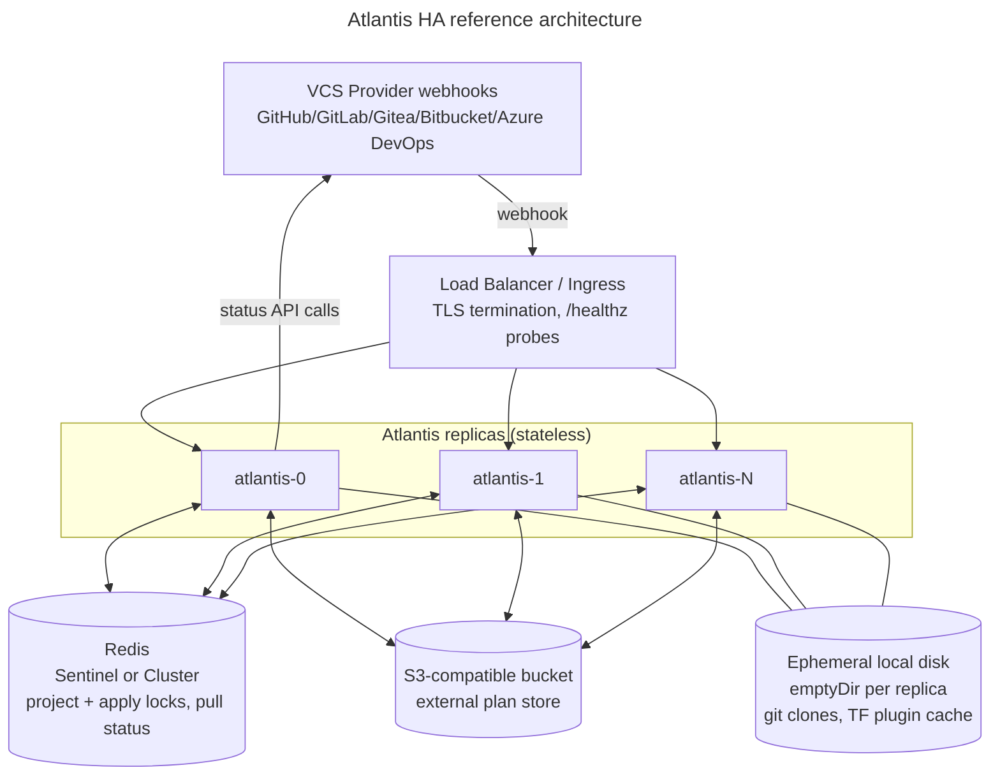

# High Availability

This page describes how to plan and design a high-availability (HA) deployment
of Atlantis: running multiple `atlantis server` replicas behind a load
balancer for resiliency and horizontal scale, without corrupting locks,
losing plans, or producing racy/duplicate Terraform runs.

It covers:

* what Atlantis already supports out of the box today,
* the failure modes you'll hit if you just add replicas without reading this page,
* a recommended reference architecture,
* a phased rollout plan, and
* a backlog of known code-level gaps that limit "pure" HA today, for teams
  who want to contribute fixes upstream.

::: tip
If you only need one thing from this page: run `--locking-db-type=redis`
**and** either a shared `--data-dir` filesystem or
`--enable-external-stores` with an S3-compatible plan store. See
[Recommended reference architecture](#recommended-reference-architecture).
:::

## Why HA is different for Atlantis than for a typical stateless web app

Atlantis is not a pure request/response web service. A single logical
operation - "plan this PR" then later "apply this PR" - is split across two
separate webhook deliveries that can arrive minutes, hours, or days apart,
and in between them Atlantis:

* holds a **project/workspace lock** so a second plan/apply can't run concurrently
  against the same Terraform state,
* keeps a **git clone on local disk** that `apply` re-uses (or, if unavailable,
  a **plan file** it needs to re-apply exactly what was planned), and
* streams **live Terraform output** to the pull request's Atlantis UI link.

If `plan` runs on replica A and the follow-up `apply` webhook lands on
replica B, B needs to be able to see A's lock, clone/plan artifacts, and
(ideally) logs. That shared-state requirement is the crux of Atlantis HA
design - it's not just "add more pods."

## Current state: what Atlantis already supports

| Concern | Default (single instance) | HA-capable option | Config |
|---|---|---|---|
| Project/workspace locks, global apply lock | [BoltDB](https://github.com/etcd-io/bbolt) file under `--data-dir` (single-process only) | Redis (single-node or Cluster) | `--locking-db-type=redis`, `--redis-host`/`--redis-port` or `--redis-cluster-addresses` |
| Pull request status / plan summaries | Same BoltDB/Redis-backed DB | Same as above | Same as above |
| Git clones + `.tfplan` files | Local disk under `--data-dir` | Shared filesystem (NFS/EFS/Filestore) across replicas, **or** stateless with external plan storage | `--data-dir` on a shared volume, **or** `--enable-external-stores` + `external_stores` S3 block in [server-side repo config](server-side-repo-config.md) |
| Rolling restarts / deploys | `SIGTERM` triggers a graceful drain that waits for in-flight plan/apply operations before exiting | Same, works per-replica | N/A - built in (`server/events/drainer.go`) |
| Health checks | `GET /healthz` | Same, used for K8s/LB liveness+readiness probes | N/A - built in |

This is already documented at a high level in the [FAQ](faq.md) and
[Server Configuration](server-configuration.md#--locking-db-type); this page
goes deeper on the operational and architectural implications.

### Locking

`locking.Client` locks by the tuple `{repo}/{path}/{workspace}/{projectName}`
and delegates storage to a pluggable `db.Database` (`server/core/locking/locking.go`).
Two backends exist:

* **BoltDB** (`server/core/boltdb/boltdb.go`) - a single embedded file,
  `{data-dir}/atlantis.db`. It takes an exclusive file lock, so **a second
  process (or replica) pointed at the same file will fail to start** ("timeout
  (a possible cause is another Atlantis instance already running)"). This
  backend is fundamentally single-instance.
* **Redis** (`server/core/redis/redis.go`) - a shared, network-accessible
  store safe for multiple replicas.

A global apply lock (`server/core/locking/apply_locking.go`) uses the same
database and fails closed (rejects applies) if the backend is unreachable -
this fail-closed behavior is intentional and should be preserved in any HA
design (never fall back to "allow" when the lock store is down).

### Working directory & plan storage

Clones live on local disk at
`{data-dir}/repos/{repoFullName}/{pullNum}/{workspace}/`
(`server/events/working_dir.go`), and `.tfplan` files are written inside
that same clone directory. `apply` re-uses that clone if it's still present
and at the expected commit; otherwise it re-clones and needs some way to
recover the plan.

Two supported ways to make this safe across replicas:

1. **Shared filesystem** for `--data-dir` (e.g. NFS, EFS, Filestore) mounted
   `ReadWriteMany` on every replica. Simple, but couples every replica to a
   shared-storage dependency and its own availability/latency profile.
2. **External plan store** via `--enable-external-stores` with an
   S3-compatible `external_stores.plan_store` block in the server-side repo
   config (`server/core/planstore/s3_plan_store.go`). After `plan`, the
   `.tfplan` is uploaded to S3; on `apply`, if the local clone is missing or
   stale, Atlantis re-clones and restores the plan from S3
   (`PlanStore.Load` / `RestorePlans`). This is the path to **stateless**
   replicas (`emptyDir`/ephemeral local disk is fine).

### Graceful shutdown

`atlantis server` already handles `SIGTERM`/`SIGINT` by stopping new HTTP
accepts and calling `Drainer.ShutdownBlocking()`, which waits for in-flight
plan/apply operations to finish before the process exits
(`server/server.go`, `server/events/drainer.go`). This is exactly what you
want for rolling deploys behind a load balancer - pair it with a Kubernetes
`preStop` hook / adequate `terminationGracePeriodSeconds` so the LB has time
to stop routing new traffic before the pod is killed mid-`apply`.

## Gaps to be aware of (things that stay per-replica)

These are not blockers for a working HA deployment, but they are places
where behavior degrades or gets replica-sticky rather than being fully
transparent. Plan your architecture (and user expectations) around them:

| State | Where it lives today | Impact without mitigation |
|---|---|---|
| Working-dir concurrency lock (`WorkingDirLocker`) | In-process `map` + `sync.Mutex` (`server/events/working_dir_locker.go`) | Only prevents concurrent use of a clone *within one replica*. Two replicas can both believe they "won" the pull-level lock for the same PR at nearly the same instant (see Redis race below), and both start using/mutating the same shared clone on disk. |
| Redis project lock `TryLock` | GET-then-SET, not atomic (`server/core/redis/redis.go`) | Small race window where two replicas can both acquire what they think is the same lock. `UnlockIfOwnedByPull` already uses a Lua script for atomic ownership checks - `TryLock` should get the same treatment (`SET key value NX` in one round trip) before you rely on Redis locking under high concurrency. |
| Streaming Terraform logs (`server/jobs/project_command_output_handler.go`) | In-memory per-replica buffers/receivers | The "live logs" link in a PR comment only works if the browser reaches the **same replica** that ran the command. Documented today for the single-instance case in [Real-time Terraform Logs](streaming-logs.md); under a naive round-robin LB, users will intermittently see "job not found" for logs on other replicas. |
| Drift detection cache (`server/core/drift/storage.go`) | `InMemoryStorage` (there's a pluggable `Storage` interface, but no Redis/DB-backed implementation shipped yet) | `GET /api/drift/status` results are only visible on the replica that ran `POST /api/drift/detect`. |
| Webhook delivery dedup | None | No delivery-ID tracking, so retried webhook deliveries (VCS providers retry on 5xx/timeout) can be picked up more than once. Project/PR locking limits the blast radius, but it's not a substitute for idempotency. |

None of these affect **correctness** of the actual `terraform plan`/`apply`
runs when Redis locking + shared plan storage are in place - they affect UX
(log streaming, drift status visibility) and a narrow lock-acquisition race.
See [Closing the gaps](#closing-the-gaps-suggested-follow-up-work) below if
you want to help fix them upstream.

## Recommended reference architecture

### Components

1. **Load balancer / Ingress** - terminates TLS (or passes through to
   Atlantis' own `--ssl-cert-file`/`--ssl-key-file`), routes to any healthy
   replica, and uses `GET /healthz` for liveness/readiness. No sticky
   sessions are required for webhook delivery correctness (any replica can
   handle any webhook once Redis + external plan storage are configured);
   see [Log streaming and drift status](#log-streaming-and-drift-status)
   below if you also want to keep the UI log/drift links replica-transparent.

2. **N Atlantis replicas**, deployed as a `Deployment` (not a `StatefulSet`
   - once you're using Redis + S3 there's no per-replica identity or
   per-replica volume to preserve), each stateless:
   * `--locking-db-type=redis`
   * `--enable-external-stores` with `external_stores.plan_store` (S3) in
     server-side repo config
   * `--data-dir` on ephemeral storage (`emptyDir`/local disk is fine - only
     used as a working scratch space and TF binary/plugin cache)

3. **Redis**, deployed HA itself (Sentinel for single-primary failover, or
   Redis Cluster for sharding + failover), or a managed service (AWS
   ElastiCache, GCP Memorystore, Azure Cache for Redis) with Multi-AZ
   enabled. Redis is now on Atlantis' critical path for **every** plan/apply
   (project lock) and for the global apply lock, and the apply lock check
   fails closed if Redis is unreachable - so Redis availability directly
   caps Atlantis availability. Enable RDB/AOF persistence (or rely on your
   managed service's durability) since a lost lock DB just means users need
   to re-`plan` open PRs, not a scarier outcome - but frequent full lock
   loss under load is a bad experience.

4. **S3-compatible bucket** for the external plan store, with lifecycle
   rules to expire old plan objects (they're only needed until `apply` or
   PR close/merge) and versioning disabled (Atlantis manages its own
   object keys per plan).

5. **Terraform/OpenTofu binaries and plugin cache**: each replica downloads
   these into `--data-dir/bin` and `--data-dir/plugin-cache` on first use
   (`server/server.go`). With ephemeral local disk this happens on every
   pod start/restart. For faster cold starts at scale, consider:
   * pre-baking commonly used Terraform/OpenTofu versions into the container
     image, or
   * mounting a shared **read-only** cache volume (e.g. a `ReadOnlyMany`
     PVC populated by an init job) if your Terraform version matrix is
     large and download latency matters.

### Sizing and autoscaling

Atlantis' load is bursty and CPU/IO-heavy during `plan`/`apply` (spawning
`terraform`/`tofu` subprocesses), not steady-state request throughput.
Guidelines:

* Size CPU/memory requests around your **largest concurrent
  `--parallel-pool-size`** (per-replica project parallelism) times replica
  count, not webhook request volume.
* Prefer **more, smaller replicas** over fewer large ones - it bounds the
  "blast radius" of one pod's OOM/crash to a smaller slice of in-flight
  plans (which just need a re-`plan`, not a catastrophic failure) and gives
  the load balancer more failover targets.
* If autoscaling (HPA) on CPU, set a conservative `terminationGracePeriodSeconds`
  and rely on the built-in `Drainer` (see [Graceful shutdown](#graceful-shutdown))
  so scale-down doesn't kill an in-flight `apply`.
* Use a `PodDisruptionBudget` (e.g. `minAvailable: 1` or a percentage) so
  cluster upgrades/node drains don't take down all replicas simultaneously.

### Log streaming and drift status

Until the [gaps above](#gaps-to-be-aware-of-things-that-stay-per-replica) are
closed upstream, pick one of:

* **Accept the limitation**: most users only click the "Show Output" link
  right after triggering a command, while the originating replica is likely
  still handling their session/connection reuse through the LB. Document it
  as a known limitation for your users.
* **Sticky sessions** on the load balancer (e.g. cookie-based affinity)
  scoped just to the UI/log-viewing paths, trading a little bit of your
  "no sticky sessions" HA purity for a better UX on this one feature.
* **Contribute a shared backend** (Redis pub/sub or a shared object store
  for completed job logs, and a Redis/DB-backed `drift.Storage`
  implementation) - see [Closing the gaps](#closing-the-gaps-suggested-follow-up-work).

## Phased rollout plan

You don't need to do this all at once. A safe migration path from a single
instance:

1. **Baseline**: confirm you're running with `--data-dir` on persistent
   storage today (BoltDB + local clones), single replica, `SIGTERM`-aware
   process supervision (systemd/K8s). This is the existing recommended
   single-instance setup.
2. **Move locking to Redis** (`--locking-db-type=redis`), still with a
   single replica. This is a safe, reversible change and lets you validate
   Redis connectivity/latency/auth in production before adding replicas.
3. **Scale to 2 replicas with a shared filesystem** for `--data-dir`
   (`ReadWriteMany` PVC/NFS/EFS). Validate: plan on one replica, apply
   routed to the other, confirm it works and logs land correctly for at
   least the "you're on the replica that ran it" case.
4. **Switch to external plan storage** (`--enable-external-stores` + S3) and
   drop the shared filesystem requirement, moving `--data-dir` to ephemeral
   storage. Re-validate the plan→apply cross-replica flow.
5. **Scale out** to your target replica count, add `PodDisruptionBudget`,
   tune HPA if used, and decide on your log-streaming/drift-status tradeoff
   (accept limitation vs. sticky sessions vs. upstream contribution).
6. **Chaos-test failover**: kill a replica mid-`apply` and confirm the
   `Drainer`-based graceful shutdown lets it finish (or, if force-killed,
   that the resulting stuck lock is discoverable/unlockable via
   `atlantis unlock` and the [locking docs](locking.md)); fail Redis over
   (Sentinel/Cluster) and confirm applies correctly fail closed rather than
   silently proceeding unlocked.

## Closing the gaps (suggested follow-up work)

For teams who want to push Atlantis further toward "no caveats" HA and are
willing to contribute upstream, the highest-value fixes, roughly in order of
impact-to-effort:

1. **Atomic Redis `TryLock`**: replace `server/core/redis/redis.go`'s
   GET-then-SET `TryLock` with a single atomic `SET key value NX` (or a Lua
   script, matching the pattern already used by `UnlockIfOwnedByPull`) to
   remove the acquire-race window entirely.
2. **Redis/DB-backed drift `Storage`**: implement the existing
   `drift.Storage` interface (`server/core/drift/storage.go`) against Redis
   (or the same `db.Database` used for locking) so `GET /api/drift/status`
   is consistent across replicas, mirroring how plan/apply locking already
   works.
3. **Shared job-output/log backend**: back
   `server/jobs/project_command_output_handler.go` with Redis Streams/pub-sub
   (or persist completed logs to the same S3 bucket used for plans) so the
   "Show Output" links work regardless of which replica serves the request.
4. **Webhook delivery idempotency**: track recently-seen delivery IDs
   (e.g. GitHub's `X-GitHub-Delivery` header) in the shared DB with a short
   TTL, and short-circuit duplicate deliveries in
   `server/controllers/events/events_controller.go` before they reach
   `CommandRunner`.
5. **Durable command queue (larger effort)**: today, `RunAutoplanCommand`/
   `RunCommentCommand` are dispatched as bare goroutines
   (`server/controllers/events/events_controller.go`) with no persistence -
   if a replica is killed between "accepted the webhook" and "finished
   processing," that unit of work is simply lost (the user has to comment
   `atlantis plan` again). A durable queue (Redis Streams, SQS, etc.) between
   ingestion and execution would let another replica pick up abandoned work
   after a crash, at the cost of meaningfully more architectural complexity.
   Given Atlantis' "just re-plan" recovery story, this is the lowest-priority
   item unless your organization has very high reliability requirements.

## See also

* [FAQ: How to run Atlantis in high availability mode?](faq.md)
* [Server Configuration](server-configuration.md) - `--locking-db-type`,
  `--redis-*`, `--enable-external-stores` flag reference
* [Server Side Repo Config](server-side-repo-config.md) - `external_stores`
  block reference
* [Locking](locking.md) - how project/workspace locking works
* [Real-time Terraform Logs](streaming-logs.md) - streaming logs architecture
* [Deployment](deployment.md) - Kubernetes/Helm/Fargate/GKE deployment options
* [Atlantis on Google Cloud Run](../blog/2025/atlantis-on-google-cloud-run.md) -
  a worked example of multiple Atlantis instances behind a load balancer
